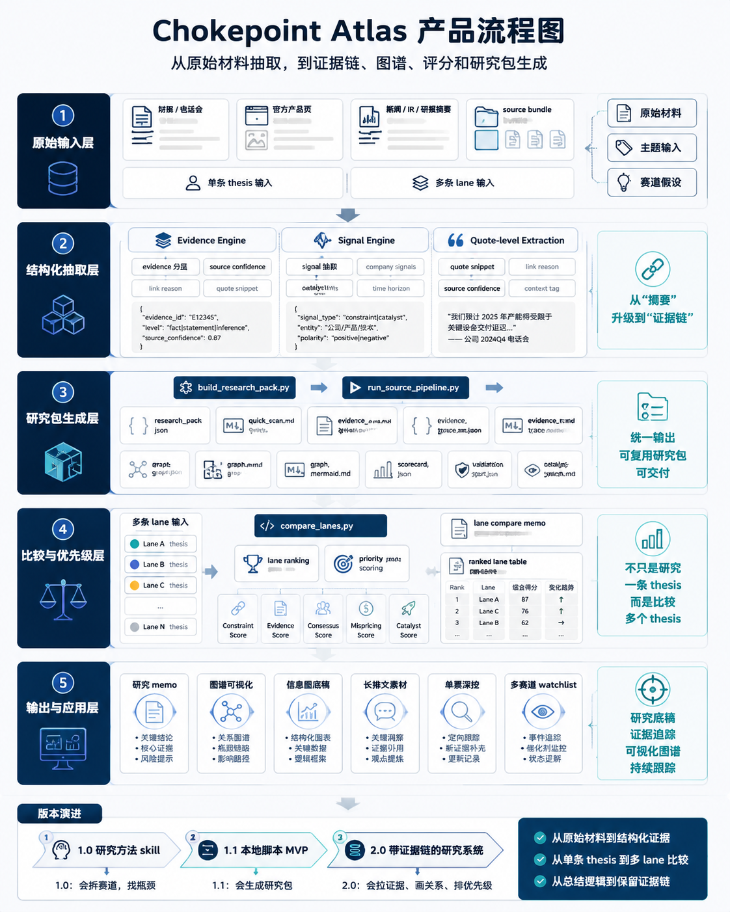

# 卡脖子美股战法

> 用供应链瓶颈思维研究 AI 美股

🌐 Language / 语言： [中文](./README.md) | [English](./docs/PRODUCT_EN.md)

📘 产品介绍： [中文介绍](./README.md) | [English Intro](./docs/PRODUCT_EN.md)

> **这是一个专门用来找“AI 产业链里谁在卡脖子”的美股研究产品。**  
> 你给它一个方向，它帮你拆系统、找瓶颈、拉证据、整理候选公司。不是直接喊单，也不是一句话给你报票。

## 它是做什么的

说人话：

如果你想研究 AI、算力、机器人、光通信、先进封装这些方向，但又不想像买 meme 一样瞎冲，这个产品就是帮你先把产业链拆开，看看**到底哪一层最容易堵车，哪家公司是真的绕不过去**。

它主要做 4 件事：

1. 先选一个真实系统  
   例如 `NVIDIA DSX AI Factory`、`TPU pod`、`机器人执行器链条`、`数据中心供电和液冷`
2. 再把这个系统拆成上下游  
   从最终需求、系统集成、核心部件，一直拆到测试、封装、材料和上游工具
3. 找真正的卡点  
   不是先问哪只票会涨，而是先问：**如果需求继续放大，哪一层会先卡住？**
4. 拉证据，做研究包  
   把财报、电话会、官网、新闻、研报里的线索整理成一套能复用的结论

一句话理解：

**它是把“热门叙事”翻译成“供应链研究”的工具。**

## 它适合谁

适合这几种人：

- 想研究美股 AI 产业链，但不想只看热门大票
- 想找“第二层、第三层瓶颈”这种更有弹性的方向
- 手里已经有一些新闻、财报、研报，想整理成结构化结论
- 想让 Agent 帮你做研究，不只是帮你写摘要

如果你只是想问一句“现在买哪只最猛”，那它不是最适合你的东西。

## 它现在怎么用

目前有 3 种主要用法。

### 1. 单条研究线直接出研究包

适合你已经知道自己想研究哪条线。

- 脚本：`scripts/build_research_pack.py`
- 示例输入：`examples/ai_factory_lane_input.json`

你会拿到这类输出：

- `quick_scan.md`
- `evidence_memo.md`
- `evidence_trace.md`
- `graph.json`
- `graph_mermaid.md`
- `scorecard.json`
- `catalyst_watch.md`

### 2. 多条研究线横向比较

适合你还没决定先研究哪条线，想先排优先级。

- 脚本：`scripts/compare_lanes.py`
- 示例输入：`examples/lane_compare_input.json`

你会拿到：

- `lane_ranking.json`
- `lane_details.json`
- `ranked_lane_table.md`
- `lane_compare_memo.md`

### 3. 原始材料直接整理成研究包

适合你手上已经有材料，但不想自己手动整理。

- 脚本：`scripts/run_source_pipeline.py`
- 示例输入：`examples/source_bundle_input.json`

这条流程会先抽取：

- evidence
- signal
- quote snippet
- source confidence
- link reason

然后再继续生成最终研究包。

## 它和普通 AI 选股问答有什么区别

普通玩法通常是：

- 问 AI 哪只票好
- 问 AI 帮我总结财报
- 问 AI 这个赛道值不值得看

卡脖子美股战法不是这么走的。

它的顺序是：

1. 先定系统
2. 再拆上下游
3. 再找瓶颈
4. 再拉证据
5. 最后才给方向和候选公司

区别就在这里：

**它不是替你拍脑袋，而是帮你把研究流程做扎实。**

## 最后会产出什么

每条研究线最后尽量会落成一组结构化文件：

- `research_pack.json`
- `quick_scan.md`
- `evidence_memo.md`
- `evidence_trace.json`
- `evidence_trace.md`
- `graph.json`
- `graph.mmd`
- `graph_mermaid.md`
- `graph_card.md`
- `scorecard.json`
- `validation_report.json`
- `catalyst_watch.md`

## 继续看

- [完整中文产品说明](./docs/PRODUCT_CN.md)
- [English Product Description](./docs/PRODUCT_EN.md)
- [SKILL.md](./SKILL.md)
- [Product Manual](./references/product-manual.md)
